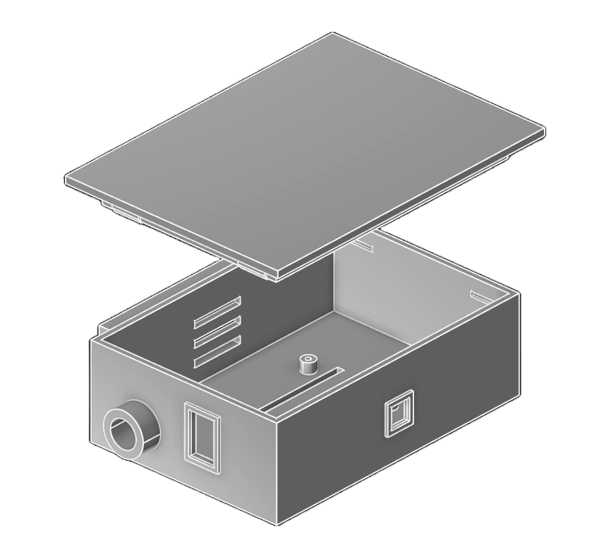

<div align="center">

# ☀️ Solar Sentinel

**Autonomous Solar Panel Defect Detection & Classification**

*Computer Vision + Agentic AI running entirely on a Raspberry Pi 5*

[](https://python.org)
[](https://docs.ultralytics.com/models/yolo26/)
[](https://crewai.com)
[](https://fastapi.tiangolo.com)
[](LICENSE)

---

*A bachelor's thesis project that deploys a fine-tuned YOLO26 Nano object detection model alongside a multi-agent LLM pipeline on edge hardware to autonomously monitor solar panels, detect defects, and generate actionable maintenance reports — no cloud required.*

</div>

---

## 🔍 Overview

Solar Sentinel is an end-to-end autonomous maintenance system for solar panels. It captures images using a camera mounted on a Raspberry Pi 5, runs real-time defect detection using a custom-trained YOLO26 Nano model, and — when a defect is found — triggers a multi-agent CrewAI pipeline powered by Google Gemini to analyze the defect, write a professional maintenance report, and send notifications via email or Telegram.

**Everything runs locally on the Pi.** The only external calls are to the Gemini API (for LLM reasoning) and Open-Meteo (for weather context). No images leave the device.

### Key Features

- 🎯 **3-Class Detection** — `damage` · `blockage` · `healthy`
- 🤖 **Agentic Analysis** — Multi-agent pipeline (Analyst → Report Writer → QA Reviewer)
- 🔧 **MCP Tool Integration** — Agents access weather, time, and web search tools *(planned)*
- 🌡️ **Environmental Context** — Temperature/humidity sensor + weather API enrich reports *(planned)*
- 📱 **Multi-Channel Alerts** — Email (SMTP) and Telegram notifications with attached imagesGitHub open-source project
- 🔄 **Adaptive Scheduling** — Capture frequency adapts to detection results
- 🌙 **Daylight-Aware** — Only captures during daylight hours
- 🛡️ **Smart Triage** — Rule-based filtering (deduplication, transient rejection, exposure check) before any LLM call
- 🌐 **Web Dashboard** — FastAPI backend with REST API and static UI

---

## 🏗️ System Architecture

The system follows a multi-stage pipeline architecture. The diagram below shows the complete algorithmic flow from image capture to notification delivery:

<div align="center">


</div>

---

## ⚙️ How It Works

A step-by-step walkthrough of the algorithmic flow:

### Step 1 · Trigger

The system can be triggered in three ways:

| Trigger | Description |
|:--------|:------------|
| **Periodic** | Adaptive scheduler captures frames every *N* minutes (default: 15 min, adjusts based on results) |
| **Manual** | User triggers a capture via the web UI or REST API |
| **Sensor** | Temperature/humidity threshold exceeded *(planned)* |

### Step 2 · Image Capture

The **Camera Module 3 Wide** captures a still frame at 640×640 resolution. Before processing, a **frame quality check** runs — frames that are >30% overexposed or underexposed are rejected immediately to avoid false positives from glare or darkness.

### Step 3 · YOLO26 Nano Inference

The captured frame is passed to the **YOLO26 Nano** model (exported to NCNN format for ARM optimization). The model outputs bounding boxes with class labels and confidence scores:

| Class | What It Detects | Example |
|:------|:----------------|:--------|
| `damage` | Cracks, broken cells, electrical burn marks, physical deformation | Hail damage, snail trails |
| `blockage` | Dust, bird droppings, snow, leaves, debris | Soiling, partial shading |
| `healthy` | Clean panel surface, no defects | Normal operation |

### Step 4 · Confidence-Based Routing

The detection confidence score determines what happens next:

```
Detection Confidence
        │
        ├── ≥ 70%  ──→  HIGH: Trigger CrewAI pipeline immediately
        │                 ↳ Increase capture frequency to every 5 min
        │
        ├── 45-70% ──→  MEDIUM: Queue for hourly digest
        │
        └── < 45%  ──→  LOW: Log to database only, no action
                         ↳ If 6+ consecutive clean frames, reduce
                           capture frequency to every 30 min
```

### Step 5 · Triage Agent (Rule-Based)

Before any LLM call, a **rule-based triage agent** filters detections:

1. **Deduplication** — Suppresses same-class detections with IoU > 0.5 within the last 60 minutes
2. **Transient Filter** — Requires 2 consecutive detections at the same location to confirm (prevents one-off false positives)
3. **`healthy` Rejection** — Clean panels never trigger the LLM pipeline

### Step 6 · Environmental Context

When a detection passes triage, the system enriches it with context:

- **Weather** — Current conditions via [Open-Meteo](https://open-meteo.com/) (temperature, precipitation, UV index)
- **Temperature & Humidity** — Local sensor data from the Adafruit AM2302/DHT22 *(planned)*
- **Historical** — Previous detections from the SQLite database for trend analysis

### Step 7 · CrewAI Agentic Pipeline

The enriched detection triggers a **sequential multi-agent pipeline** powered by Google Gemini:

```
┌─────────────────────────────────────────────────────────────┐
│                    CrewAI Pipeline                           │
│                                                             │
│  ┌──────────────┐   ┌──────────────┐   ┌──────────────┐    │
│  │   Defect      │   │   Report     │   │     QA       │    │
│  │   Analyst     │──→│   Writer     │──→│   Reviewer   │    │
│  │              │   │              │   │              │    │
│  │ • Severity   │   │ • Markdown   │   │ • Accuracy   │    │
│  │ • Root cause │   │   report     │   │ • Score /10  │    │
│  │ • Urgency    │   │ • Plain      │   │ • Approve /  │    │
│  │ • Trend      │   │   language   │   │   reject     │    │
│  └──────────────┘   └──────────────┘   └──────────────┘    │
│                                                             │
│  MCP Server (planned)                                       │
│  ├── 🌐 Web Search Tool                                    │
│  ├── 🕐 Time Tool                                          │
│  └── ⛅ Weather Tool                                       │
└─────────────────────────────────────────────────────────────┘
```

| Agent | Role | What It Does |
|:------|:-----|:-------------|
| **Defect Analyst** | PV systems engineer | Classifies severity (CRITICAL/WARNING/INFO), identifies root cause, determines urgency, analyzes trends |
| **Report Writer** | Technical writer | Translates analysis into clear, actionable maintenance reports for field technicians |
| **QA Reviewer** | Quality engineer | Validates report accuracy, catches hallucinations, scores quality (1-10), approves or rejects |

### Step 8 · Notification Delivery

The approved report is delivered through all enabled channels:

| Channel | Protocol | Details |
|:--------|:---------|:--------|
| **Email** | SMTP | HTML-formatted report with attached detection image |
| **Telegram** | Bot API | Markdown report + photo sent to configured chat |

### Step 9 · Logging & Adaptive Sleep

Every detection (whether it triggers the pipeline or not) is logged to an **SQLite database** with:
- Image path, defect class, confidence, bounding box coordinates
- Timestamp, panel ID, analysis results (if applicable)

The scheduler then adapts its capture interval based on recent history and enters a sleep cycle until the next scheduled capture.

---

## 🔩 Hardware

<div align="center">



*Custom 3D-printed weather-resistant enclosure — designed in [KCL](https://zoo.dev/kcl) and exported to STEP*

</div>

### Components

| Component | Model | Purpose |
|:----------|:------|:--------|
| **SBC** | Raspberry Pi 5 (8GB) | Main compute — runs YOLO + CrewAI |
| **Cooling** | Raspberry Pi Active Cooler | Thermal management for sustained inference |
| **Camera** | Camera Module 3 Wide | 120° FOV, 12MP, auto-focus |
| **Sensor** | Adafruit AM2302 (DHT22) | Ambient temperature & humidity *(planned)* |
| **Enclosure** | Custom 3D-printed (PLA/PETG) | IP-rated outdoor housing |

### Enclosure Features

- 🔲 Camera lens port with rain shield
- 🌬️ Rear ventilation slots for active cooling airflow
- 📡 Internal ribbon cable channel for camera connection
- 🔌 Side cutouts for USB-C power and Ethernet
- 🔩 M2.5 standoff mounting for the Pi 5

---

## 🛠️ Tech Stack

| Layer | Technology | Role |
|:------|:-----------|:-----|
| **Computer Vision** | [YOLO26 Nano](https://docs.ultralytics.com/models/yolo26/) + [NCNN](https://github.com/Tencent/ncnn) | Object detection on ARM CPU |
| **Agentic AI** | [CrewAI](https://crewai.com) + [Google Gemini](https://ai.google.dev/) | Multi-agent defect analysis pipeline |
| **Backend** | [FastAPI](https://fastapi.tiangolo.com) + [Uvicorn](https://www.uvicorn.org/) | REST API and web server |
| **Database** | [SQLite](https://sqlite.org/) via [aiosqlite](https://github.com/omnilib/aiosqlite) | Local async persistence |
| **Notifications** | [aiosmtplib](https://aiosmtplib.readthedocs.io/) + [python-telegram-bot](https://python-telegram-bot.org/) | Email and Telegram delivery |
| **Weather** | [Open-Meteo API](https://open-meteo.com/) | Environmental context enrichment |
| **Training** | [Google Colab](https://colab.research.google.com/) + [Ultralytics](https://ultralytics.com/) | Cloud GPU training, NCNN export |
| **Hardware Design** | [KCL](https://zoo.dev/kcl) | Parametric 3D enclosure modeling |
| **Package Manager** | [uv](https://docs.astral.sh/uv/) | Fast Python dependency management |

---

## 📁 Project Structure

```
solar-sentinel/
├── casing/                          # 3D-printed enclosure
│   ├── main.kcl                     # Parametric KCL model
│   ├── main.step                    # STEP export for printing/SolidWorks
│   └── case-exploded.png            # Exploded view render
│
├── docs/                            # Documentation
│   └── Algorithmic flow.drawio.png  # System architecture diagram
│
├── src/                             # Application source
│   ├── app/
│   │   ├── main.py                  # FastAPI entry point + lifespan
│   │   ├── config.py                # Pydantic settings (from .env)
│   │   │
│   │   ├── core/                    # Core pipeline
│   │   │   ├── camera.py            # Pi Camera / stub adapter
│   │   │   ├── detector.py          # YOLO26n inference wrapper
│   │   │   ├── triage.py            # Rule-based detection filter
│   │   │   └── scheduler.py         # Adaptive capture scheduler
│   │   │
│   │   ├── agents/                  # CrewAI agentic layer
│   │   │   ├── crew.py              # Crew orchestration
│   │   │   ├── model_router.py      # Gemini model discovery + ranking
│   │   │   └── config/
│   │   │       ├── agents.yaml      # Agent role definitions
│   │   │       └── tasks.yaml       # Task descriptions
│   │   │
│   │   ├── services/                # External integrations
│   │   │   ├── gemini.py            # Google Gemini client
│   │   │   ├── notifications.py     # Email + Telegram delivery
│   │   │   └── weather.py           # Open-Meteo weather service
│   │   │
│   │   ├── api/                     # REST API
│   │   │   ├── deps.py              # Dependency injection
│   │   │   └── routes/
│   │   │       ├── health.py        # System health endpoint
│   │   │       ├── camera.py        # Capture control
│   │   │       ├── detections.py    # Detection history
│   │   │       ├── reports.py       # Generated reports
│   │   │       └── settings.py      # Runtime config
│   │   │
│   │   ├── db/                      # Database layer
│   │   │   └── database.py          # Async SQLite operations
│   │   │
│   │   └── models/                  # Pydantic schemas
│   │
│   ├── notebooks/
│   │   └── train_yolo26n.ipynb      # 📓 Colab training notebook
│   │
│   ├── tests/                       # Test suite
│   ├── pyproject.toml               # Dependencies & tool config
│   └── .env                         # Environment variables (not committed)
│
├── LICENSE                          # MIT License
└── README.md                        # ← You are here
```

---

## 🚀 Getting Started

### Prerequisites

- **Raspberry Pi 5** (8GB recommended) with Raspberry Pi OS (64-bit)
- **Camera Module 3 Wide** connected via ribbon cable
- **Python 3.11+**
- **[uv](https://docs.astral.sh/uv/)** package manager

### 1. Clone & Install

```bash
git clone https://github.com/p3rc1va1/solar-sentinel.git
cd solar-sentinel/src

# Install dependencies with uv
uv sync
```

### 2. Configure Environment

```bash
cp .env.example .env
```

Edit `.env` with your settings:

```env
# Required — Gemini API key for CrewAI agents
GEMINI_API_KEY=your-gemini-api-key

# Optional — Email notifications
EMAIL_ENABLED=true
EMAIL_ADDRESS=you@example.com
SMTP_USERNAME=you@gmail.com
SMTP_PASSWORD=your-app-password

# Optional — Telegram notifications
TELEGRAM_ENABLED=true
TELEGRAM_BOT_TOKEN=your-bot-token
TELEGRAM_CHAT_ID=your-chat-id

# Optional — Weather context (get coords from Google Maps)
WEATHER_LATITUDE=54.6872
WEATHER_LONGITUDE=25.2797

# Model path (default works after training)
YOLO_MODEL_PATH=data/models/best.pt
```

### 3. Train the Model

Open `src/notebooks/train_yolo26n.ipynb` in [Google Colab](https://colab.research.google.com/) and follow the step-by-step cells. The notebook:

1. Downloads 3 solar panel defect datasets from Roboflow
2. Merges and remaps classes to `damage` / `blockage` / `healthy`
3. Fine-tunes YOLO26 Nano (50 epochs, ~15 min on T4 GPU)
4. Exports to NCNN format for Pi 5

Copy the trained model to your Pi:
```bash
scp best.pt pi@<pi-ip>:~/solar-sentinel/src/data/models/
```

### 4. Run

```bash
cd src
uv run uvicorn app.main:app --host 0.0.0.0 --port 8000
```

The API is now live at `http://<pi-ip>:8000`. Key endpoints:

| Endpoint | Method | Description |
|:---------|:-------|:------------|
| `/api/health` | GET | System status, model info, uptime |
| `/api/camera/capture` | POST | Trigger manual capture + detection |
| `/api/detections` | GET | Detection history |
| `/api/reports` | GET | Generated maintenance reports |
| `/api/settings` | GET/PUT | Runtime configuration |

---

## 📊 Detection Classes

| Class | ID | Triggers Alert | What the Model Detects |
|:------|:---|:---------------|:-----------------------|
| **damage** | 0 | ✅ → CrewAI | Cracks, broken cells, electrical burn marks, snail trails, physical deformation |
| **blockage** | 1 | ✅ → CrewAI | Dust accumulation, bird droppings, snow coverage, leaves, debris |
| **healthy** | 2 | ❌ | Clean panel surface — no action needed |

---

## 🗺️ Roadmap

- [x] YOLO26n model training pipeline
- [x] CrewAI multi-agent analysis
- [x] Email & Telegram notifications
- [x] Adaptive capture scheduling
- [x] Rule-based triage agent
- [x] Weather context enrichment
- [x] 3D-printed enclosure design
- [x] Colab training notebook
- [ ] MCP server for agent tool access
- [ ] DHT22 temperature/humidity sensor integration
- [ ] Live view with real-time YOLO overlay (MJPEG)
- [ ] Web dashboard UI
- [ ] Gemini model auto-discovery and fallback chain

---

## 📄 License

This project is licensed under the [MIT License](LICENSE).

