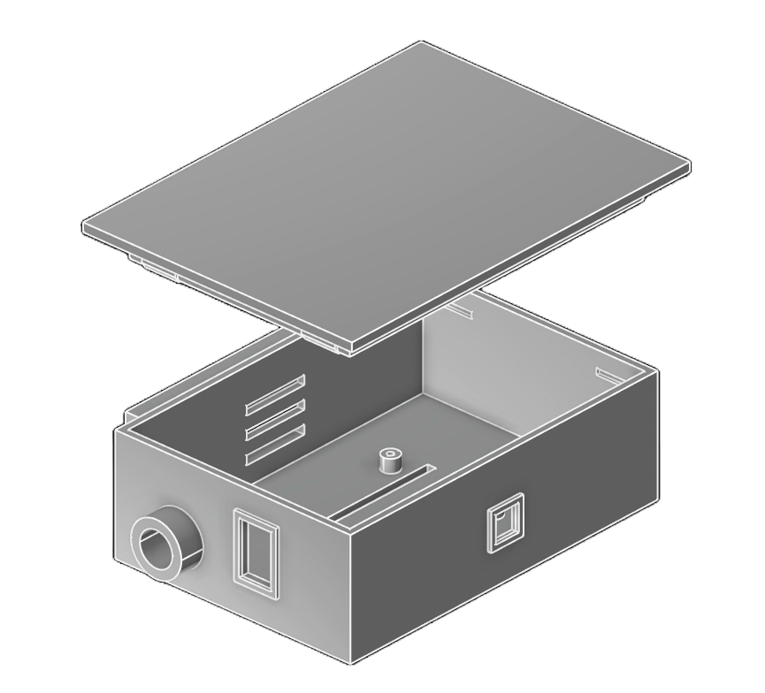

<div align="center">

# ☀️ Solar Sentinel

**Autonomous Solar Panel Defect Detection & Classification**

*Computer Vision + Agentic AI running entirely on a Raspberry Pi 5*

[](https://python.org)
[](https://docs.ultralytics.com/models/yolo26/)
[](https://crewai.com)
[](https://fastapi.tiangolo.com)
[](LICENSE)

---

*A bachelor's thesis project that deploys a fine-tuned YOLO26 Nano object detection model alongside a multi-agent LLM pipeline on edge hardware to autonomously monitor solar panels, detect defects, and generate actionable maintenance reports — no cloud required.*

</div>

---

## 🔍 Overview

Solar Sentinel is an end-to-end autonomous maintenance system for solar panels. It captures images using a camera mounted on a Raspberry Pi 5, runs real-time defect detection using a custom-trained YOLO26 Nano model, and — when a defect is found — triggers a multi-agent CrewAI pipeline powered by Google Gemini to analyze the defect, write a professional maintenance report, and send notifications via email or Telegram.

**Everything runs locally on the Pi.** The only external calls are to the Gemini API (for LLM reasoning) and Open-Meteo (for weather context). No images leave the device.

### Key Features

- 🎯 **Binary Detection** — `defect` (damage or blockage) · `healthy` — class granularity resolved by the agentic layer
- 🤖 **Agentic Analysis** — Multi-agent pipeline (Analyst → Report Writer → QA Reviewer)
- 🔧 **MCP Tool Integration** — Agents access weather, time, and web search tools *(not yet implemented)*
- 🌡️ **Environmental Context** — Temperature/humidity sensor (DHT22) + Open-Meteo weather API enrich reports
- 📱 **Multi-Channel Alerts** — Email (SMTP) and Telegram notifications with attached images
- 🔄 **Adaptive Scheduling** — Capture frequency adapts to detection results
- 🌙 **Daylight-Aware** — Only captures during daylight hours (06:00–20:00, hardcoded)
- 🛡️ **Smart Triage** — Rule-based filtering (deduplication, transient rejection, exposure check) before any LLM call
- 🌐 **Web Dashboard** — FastAPI backend with REST API and static UI

---

## 🏗️ System Architecture

The system follows a multi-stage pipeline architecture. The diagram below shows the complete algorithmic flow from image capture to notification delivery:

<div align="center">


</div>

---

## ⚙️ How It Works

A step-by-step walkthrough of the algorithmic flow:

### Step 1 · Trigger

The system can be triggered in three ways:

| Trigger | Description |
|:--------|:------------|
| **Periodic** | Adaptive scheduler captures frames every *N* minutes (default: 15 min, adjusts based on results) |
| **Manual** | User triggers a capture via the web UI or REST API |
| **Sensor** | DHT22 thresholds: temp >35°C (PV efficiency drop), temp <0°C (icing risk), humidity >85% (particulate cementation) *(not yet implemented — sensor is read for context only)* |

### Step 2 · Image Capture

The **Camera Module 3 Wide** captures a still frame at 640×640 resolution. Before processing, a **frame quality check** runs — frames that are >30% overexposed or underexposed are rejected immediately to avoid false positives from glare or darkness.

### Step 3 · YOLO26 Nano Inference

The captured frame is passed to the **YOLO26 Nano** model (exported to NCNN format for ARM optimization). Per the thesis design, the model acts as a **binary smart trigger** — classifying frames as `defect` or `healthy` — because defect sub-type analysis (damage vs. blockage) is delegated to the agentic pipeline's VLM capabilities, which provides better semantic understanding. The model outputs bounding boxes with confidence scores:

| Class | What It Detects | Action |
|:------|:----------------|:-------|
| `defect` | Any anomaly: cracks, burns, soiling, debris, snow | Routes to confidence-based pipeline |
| `healthy` | Clean panel surface — no anomalies | No action, logs clean frame |

> **Note:** The current code still trains with `damage` / `blockage` / `healthy` classes. The thesis describes the intended final design as binary (`defect` / `healthy`). Recent commits reflect this migration in progress.

### Step 4 · Confidence-Based Routing

The detection confidence score determines what happens next:

```
Detection Confidence
        │
        ├── ≥ 70%  ──→  HIGH: Trigger CrewAI pipeline immediately
        │                 ↳ Increase capture frequency to every 5 min
        │
        ├── 45-70% ──→  MEDIUM: Log to database (hourly digest not yet implemented)
        │
        └── < 45%  ──→  LOW: Log to database only, no action
                         ↳ If 6+ consecutive clean frames, reduce
                           capture frequency to every 30 min
```

### Step 5 · Triage Agent (Rule-Based)

Before any LLM call, a **rule-based triage agent** filters detections:

1. **Deduplication** — Suppresses same-class detections with IoU > 0.5 within the last 60 minutes
2. **Transient Filter** — Requires 2 consecutive detections at the same location to confirm (prevents one-off false positives)
3. **`healthy` Rejection** — Clean panels never trigger the LLM pipeline

### Step 6 · Environmental Context

When a detection passes triage, the system enriches it with context:

- **Weather** — Current conditions via [Open-Meteo](https://open-meteo.com/) (temperature, precipitation, UV index)
- **Temperature & Humidity** — Local sensor data from the Adafruit AM2302/DHT22 (reads in background; included in report context)
- **Historical** — Previous detections from the SQLite database for trend analysis

### Step 7 · CrewAI Agentic Pipeline

The enriched detection triggers a **sequential multi-agent pipeline** powered by Google Gemini:

```
┌──────────────────────────────────────────────────────────────────┐
│                    CrewAI Pipeline                                │
│                                                                  │
│  ┌──────────────┐   ┌──────────────┐   ┌──────────────┐         │
│  │   Defect      │   │ Maintenance  │   │    Critic    │  ┌────┐ │
│  │   Analyst     │──→│   Planner    │──→│    Agent     │─→│Rpt.│ │
│  │  (VLM input) │   │  (MCP tools) │   │ (QA + web)  │  └────┘ │
│  └──────────────┘   └──────────────┘   └──────────────┘         │
│  ← ─ ─ ─ ─ thesis design (4 agents) ─ ─ ─ ─ ─ ─ ─ ─ ─ ─ ─ ─ → │
│                                                                  │
│  Current code: Analyst → Report Writer → QA Reviewer (3 agents) │
│                                                                  │
│  MCP Server (not yet implemented)                                │
│  ├── 🌐 Web Search / Fetch Tool                                 │
│  ├── 🕐 Time Tool                                               │
│  └── ⛅ Weather Forecast Tool                                   │
└──────────────────────────────────────────────────────────────────┘
```

**Thesis design (4 agents):**

| Agent | Role | What It Does |
|:------|:-----|:-------------|
| **Defect Analyst** | PV systems engineer | Uses VLM to inspect the image, confirms detection isn't a false positive (shadow, animal), classifies severity |
| **Maintenance Planner** | Field operations | Cross-references findings with weather forecast, time/daylight data, and web search to recommend context-aware actions |
| **Critic Agent** | Quality assurance | Fact-checks recommendations against web sources and fixed logic rules (e.g., "don't recommend replacement unless loss >20%") |
| **Report Writer** | Technical writer | Compiles all agent outputs into a user-friendly email/Telegram report |

**Current code (3 agents — `agents/crew.py`):** Analyst → Report Writer → QA Reviewer. The Maintenance Planner is not yet implemented; MCP tools are not wired.

### Step 8 · Notification Delivery

The approved report is delivered through all enabled channels:

| Channel | Protocol | Details |
|:--------|:---------|:--------|
| **Email** | SMTP | HTML-formatted report with attached detection image |
| **Telegram** | Bot API | Markdown report + photo sent to configured chat |

### Step 9 · Logging & Adaptive Sleep

Every detection (whether it triggers the pipeline or not) is logged to an **SQLite database** with:
- Image path, defect class, confidence, bounding box coordinates
- Timestamp, panel ID, analysis results (if applicable)

The scheduler then adapts its capture interval based on recent history and enters a sleep cycle until the next scheduled capture.

---

## 🔩 Hardware

<div align="center">



*Custom 3D-printed weather-resistant enclosure — designed in [KCL](https://zoo.dev/kcl) and exported to STEP*

</div>

### Components

| Component | Model | Purpose |
|:----------|:------|:--------|
| **SBC** | Raspberry Pi 5 (8GB) | Main compute — runs YOLO + CrewAI |
| **Cooling** | Raspberry Pi Active Cooler | Thermal management for sustained inference |
| **Camera** | Camera Module 3 Wide | 120° FOV, 12MP, auto-focus |
| **Sensor** | Adafruit AM2302 (DHT22) | Ambient temperature & humidity |
| **Enclosure** | Custom 3D-printed (ASA) | Weather-resistant outdoor housing (ASA chosen for 105°C glass transition temp and UV resistance) |

### Enclosure Specs & Features

- **Material:** ASA (Acrylonitrile Styrene Acrylate) — UV-resistant, 105°C glass transition temperature
- **Dimensions:** 179 mm × 56 mm × 133 mm · **Weight:** ~290 g total assembly
- **Wall thickness:** 3.2 mm · **Lid overhang:** 8 mm rain guard
- 🔲 Tightly fitted camera lens port and DHT22 sensor mount
- 🌬️ Ventilation slots: 30×4 mm rear panel + 80×4 mm bottom panel (natural convection)
- 🔒 Gasket groove with snapping-arm lid seal; 15.5 mm cable gland for power
- 🔩 M2.5 Pan Head (ISO 7045) standoffs for Pi 5 mounting

---

## 🛠️ Tech Stack

| Layer | Technology | Role |
|:------|:-----------|:-----|
| **Computer Vision** | [YOLO26 Nano](https://docs.ultralytics.com/models/yolo26/) + [NCNN](https://github.com/Tencent/ncnn) | Object detection on ARM CPU |
| **Agentic AI** | [CrewAI](https://crewai.com) + [Google Gemini](https://ai.google.dev/) | Multi-agent defect analysis pipeline |
| **Backend** | [FastAPI](https://fastapi.tiangolo.com) + [Uvicorn](https://www.uvicorn.org/) | REST API and web server |
| **Database** | [SQLite](https://sqlite.org/) via [aiosqlite](https://github.com/omnilib/aiosqlite) | Local async persistence |
| **Notifications** | [aiosmtplib](https://aiosmtplib.readthedocs.io/) + [python-telegram-bot](https://python-telegram-bot.org/) | Email and Telegram delivery |
| **Weather** | [Open-Meteo API](https://open-meteo.com/) | Environmental context enrichment |
| **Training** | [Google Colab](https://colab.research.google.com/) + [Ultralytics](https://ultralytics.com/) | Cloud GPU training, NCNN export |
| **Hardware Design** | [KCL](https://zoo.dev/kcl) | Parametric 3D enclosure modeling |
| **Package Manager** | [uv](https://docs.astral.sh/uv/) | Fast Python dependency management |

---

## 📁 Project Structure

```
solar-sentinel/
├── casing/                          # 3D-printed enclosure
│   ├── main.kcl                     # Parametric KCL model
│   ├── main.step                    # STEP export for printing/SolidWorks
│   └── case-exploded.png            # Exploded view render
│
├── docs/                            # Documentation
│   └── Algorithmic flow.drawio.png  # System architecture diagram
│
├── src/                             # Application source
│   ├── app/
│   │   ├── main.py                  # FastAPI entry point + lifespan + HIGH detection callback
│   │   ├── config.py                # Pydantic settings (from .env)
│   │   │
│   │   ├── core/                    # Core pipeline
│   │   │   ├── camera.py            # Pi Camera / stub adapter + MJPEG stream
│   │   │   ├── detector.py          # YOLO26n inference wrapper
│   │   │   ├── triage.py            # Rule-based filter (quality, dedup, confirmation)
│   │   │   ├── scheduler.py         # Daylight-aware adaptive capture scheduler
│   │   │   ├── sensor.py            # DHT22 temperature/humidity sensor + stub
│   │   │   └── demo.py              # Demo mode — populates DB with fake data
│   │   │
│   │   ├── agents/                  # CrewAI agentic layer
│   │   │   ├── crew.py              # Crew orchestration (Analyst → Writer → QA)
│   │   │   ├── model_router.py      # Gemini model discovery + ranking
│   │   │   └── config/
│   │   │       ├── agents.yaml      # Agent role / goal / backstory definitions
│   │   │       └── tasks.yaml       # Task prompts with {placeholder} format strings
│   │   │
│   │   ├── services/                # External integrations
│   │   │   ├── gemini.py            # Google Gemini client + model fallback
│   │   │   ├── notifications.py     # Email (SMTP) + Telegram delivery
│   │   │   └── weather.py           # Open-Meteo weather service
│   │   │
│   │   ├── api/                     # REST API
│   │   │   ├── deps.py              # Dependency injection (singleton registry)
│   │   │   └── routes/
│   │   │       ├── health.py        # GET /health — system stats + Gemini usage
│   │   │       ├── camera.py        # GET /camera/feed (MJPEG), POST /camera/capture
│   │   │       ├── detections.py    # GET /detections, GET /detections/{id}
│   │   │       ├── reports.py       # GET /reports, GET /reports/{id}
│   │   │       ├── images.py        # GET /images/{filename} — serve detection images
│   │   │       ├── sensor.py        # GET /sensor — live DHT22 reading
│   │   │       └── settings.py      # GET/PUT /settings — runtime config persisted to DB
│   │   │
│   │   ├── db/                      # Database layer
│   │   │   └── database.py          # Async SQLite (aiosqlite) — all CRUD operations
│   │   │
│   │   └── models/                  # Pydantic schemas
│   │       ├── detection.py         # DetectionRecord, BoundingBox, enums
│   │       ├── report.py            # Report models
│   │       └── settings.py          # AllSettings, NotificationSettings, etc.
│   │
│   ├── ui/                          # Web dashboard (no build step — plain HTML/JS)
│   │   ├── index.html               # SPA shell — Dashboard, Detections, Reports, Live, Settings
│   │   ├── app.js                   # All dashboard JS (fetch, charts, pagination)
│   │   └── style.css                # Styles
│   │
│   ├── notebooks/
│   │   └── train_yolo26n.ipynb      # 📓 Colab training notebook
│   │
│   ├── tests/                       # Test suite
│   ├── pyproject.toml               # Dependencies & tool config
│   └── .env                         # Environment variables (not committed)
│
├── LICENSE                          # MIT License
└── README.md                        # ← You are here
```

---

## 🚀 Getting Started

### Prerequisites

- **Raspberry Pi 5** (8GB recommended) with Raspberry Pi OS (64-bit)
- **Camera Module 3 Wide** connected via ribbon cable
- **Python 3.11+**
- **[uv](https://docs.astral.sh/uv/)** package manager

### 1. Clone & Install

```bash
git clone https://github.com/p3rc1va1/solar-sentinel.git
cd solar-sentinel/src

# Install dependencies with uv
uv sync
```

### 2. Configure Environment

```bash
cp .env.example .env
```

Edit `.env` with your settings:

```env
# Required — Gemini API key for CrewAI agents
GEMINI_API_KEY=your-gemini-api-key

# Optional — Email notifications
EMAIL_ENABLED=true
EMAIL_ADDRESS=you@example.com
SMTP_USERNAME=you@gmail.com
SMTP_PASSWORD=your-app-password

# Optional — Telegram notifications
TELEGRAM_ENABLED=true
TELEGRAM_BOT_TOKEN=your-bot-token
TELEGRAM_CHAT_ID=your-chat-id

# Optional — Weather context (get coords from Google Maps)
WEATHER_LATITUDE=54.6872
WEATHER_LONGITUDE=25.2797

# Model path (default works after training)
YOLO_MODEL_PATH=data/models/best.pt
```

### 3. Train the Model

Open `src/notebooks/train_yolo26n.ipynb` in [Google Colab](https://colab.research.google.com/) and follow the step-by-step cells. The notebook:

1. Downloads 3 solar panel defect datasets from Roboflow
2. Merges and remaps classes to `damage` / `blockage` / `healthy`
3. Fine-tunes YOLO26 Nano (50 epochs, ~15 min on T4 GPU)
4. Exports to NCNN format for Pi 5

Copy the trained model to your Pi:
```bash
scp best.pt pi@<pi-ip>:~/solar-sentinel/src/data/models/
```

### 4. Run

To run the application normally:
```bash
cd src
uv run uvicorn app.main:app --host 0.0.0.0 --port 8000
```

To run the application in **Demo Mode** (which populates a separate database with fake detections and AI reports so you can explore the UI without needing a live camera or model):
```bash
cd src
uv run python -m app.main --demo --host 0.0.0.0 --port 8000
```

The web dashboard is available at `http://<pi-ip>:8000` on the local network. For remote access from any network, the thesis recommends adding **[Tailscale](https://tailscale.com/)** — no port-forwarding required, everything stays local. Key API endpoints:

| Endpoint | Method | Description |
|:---------|:-------|:------------|
| `/health` | GET | System stats (CPU temp, memory, disk) + Gemini usage |
| `/camera/feed` | GET | MJPEG live stream (`?overlay=true` for YOLO boxes) |
| `/camera/capture` | POST | Trigger immediate capture + detection (rate-limited 10 s) |
| `/detections` | GET | Detection history with pagination |
| `/reports` | GET | Generated maintenance reports |
| `/sensor` | GET | Live DHT22 temperature & humidity reading |
| `/settings` | GET/PUT | Runtime configuration (persisted to DB) |
| `/images/{filename}` | GET | Serve a detection image by filename |

---

## 📊 Detection Classes

The thesis design uses **binary detection** — YOLO acts only as a trigger, not a classifier. The agentic pipeline (VLM) determines the defect type. The current code still uses 3 classes (migration in progress per recent commits).

| Class | Thesis Design | Current Code | Triggers Pipeline |
|:------|:-------------|:-------------|:------------------|
| **defect** | ✅ Intended final | migration in progress | ✅ → CrewAI |
| **damage** | ❌ delegated to agents | ✅ active in code | ✅ → CrewAI |
| **blockage** | ❌ delegated to agents | ✅ active in code | ✅ → CrewAI |
| **healthy** | ✅ keep | ✅ active in code | ❌ no action |

---

## 🗺️ Status

### ✅ Implemented

| Component | Notes |
|:----------|:------|
| YOLO26n training pipeline | Colab notebook — trains, exports to NCNN |
| YOLO26n inference | ultralytics wrapper; stub when model/library absent |
| Rule-based triage agent | Frame quality check, IoU deduplication, 2-hit confirmation |
| Adaptive capture scheduler | Daylight-aware (hardcoded 06:00–20:00), interval adapts on HIGH/clean |
| CrewAI 3-agent pipeline | Analyst → Report Writer → QA Reviewer (sequential, Google Gemini) |
| Gemini model auto-discovery | Dynamic API query + fallback ranked list |
| Weather context | Open-Meteo API, WMO code lookup, injected into CrewAI context |
| DHT22 sensor | `adafruit_dht` + stub; temperature/humidity injected into CrewAI context |
| Email notifications | HTML report + image attachment via SMTP/aiosmtplib |
| Telegram notifications | Markdown report + photo via `python-telegram-bot` |
| FastAPI REST API | All routes: health, camera, detections, reports, images, sensor, settings |
| MJPEG live stream | `/camera/feed` — optional YOLO bounding box overlay |
| Web dashboard UI | 5 pages: Dashboard, Detections, Reports, Live Feed, Settings |
| Demo mode | Separate DB (`solar_sentinel_demo.db`), seeded with fake detections + reports |
| Runtime settings | Persisted to SQLite, applied live to notification service |
| 3D-printed enclosure | KCL parametric model + STEP export |

### 🔲 Not Yet Implemented

| Feature | Thesis Reference | Notes |
|:--------|:----------------|:------|
| MCP server + 4 tools | §2.2, §3.3 | Agents have no tool access beyond context strings; web search, time, and weather tools unbuilt |
| Maintenance Planner agent | §1.4.3, §3.3 | 4th agent described in thesis; code has 3 agents (Analyst → Writer → QA) |
| VLM image input to agents | §1.4.3, §3.6 | Thesis describes Defect Analyst using VLM on the image; code passes only text (class name, confidence, bbox) |
| Sensor-triggered capture | §3.3 | DHT22 thresholds (>35°C, <0°C, >85% RH) not wired to scheduler; sensor reads context only |
| ROI privacy masking | §4.3 | User-defined panel boundary mask to black out non-panel pixels before inference; not implemented |
| MEDIUM detection digest | §3.11 | UI shows "daily digest" slider; backend logs MEDIUM detections only, no batch delivery |
| Real daylight calculation | §3.3 | Sunrise/sunset hardcoded 06:00–20:00; no location-based solar calculation |
| Binary detection model | §2.2 | Thesis describes final model as binary (defect/healthy); code still trains 3-class |
| Token counting | — | `tokens_used` logged as `0` — CrewAI does not expose token counts |

---

## 💰 Economics (from Thesis)

| Metric | Value |
|:-------|:------|
| **Bill of Materials** | €216 |
| **Total manufacturing cost / unit** | €301 (BOM + 3D printing + assembly labour) |
| **Suggested retail price** | €450 |
| **Commercial break-even** | ~41 units/year |
| **Annual OPEX** | €19.53 (fan/SD card amortisation + one service visit every 3 years) |
| **Annual energy savings** (5 kWp system) | ~€110 (500 kWh recovered at €0.22/kWh) |
| **ROI** | 19.05% |
| **Payback period** | 5.25 years |

---

## 📄 License

This project is licensed under the [MIT License](LICENSE).

